# Bildschirmstruktur

Die Wireframes zeigen die Zielstruktur. Der Stand der Implementierung wird in `../milestone-1.md` getrennt beschrieben. Auf Smartphones werden nebeneinanderliegende Bereiche untereinander angeordnet; der Kalender wird zur Agenda.

```mermaid
flowchart TB
 subgraph Public[Öffentliche Website]
  P1[Marke · Reisearten · Sprache · Meine Reise] --> P2[Großzügiger Foto-Hero / VIP-Assistent]
  P2 --> P3[Hotels · Villen · Yachten · Ausflüge: Karten ohne Preise]
  P3 --> P4[Anfrage: Zeitraum → Gäste → Wünsche → Kontakt]
  P4 --> P5[Kontakt · Datenschutz · Mitarbeiterzugang]
 end
 subgraph Staff[Mitarbeiter-Dashboard]
  S1[Navigation links / mobil kompakt] --> S2[Neue Anfragen · offene Angebote · Zahlungen]
  S2 --> S3[Braucht Aufmerksamkeit: sortierte Vorgänge]
  S3 --> S4[Übernehmen → Reiseakte / nächste Aufgabe]
 end
 subgraph Admin[Admin-Dashboard]
  A1[Mitarbeiter · Sicherheit · Integrationen · Audit] --> A2[Benutzerliste: Rolle / aktiv / sperren]
  A2 --> A3[Zugang erstellen · Geräte abmelden]
  A3 --> A4[Änderungen: Akteur · Zeitpunkt · Objekt]
 end
 subgraph Trip[Reiseakte]
  T1[Nummer · Status · Mitarbeiter · Kunde] --> T2[Übersicht / Reisende / Leistungen / Angebot]
  T2 --> T3[Buchung / Zahlungen / Kommunikation / Dokumente]
  T3 --> T4[Aufgaben / Kalender / Verlauf]
 end
 subgraph Calendar[Kalender]
  C1[Zeitraum · Mitarbeiter · Ressource · Status] --> C2[Agenda: Datum / Zeit / Leistung / Reise]
  C2 --> C3[Termin bearbeiten → Konfliktprüfung → Änderung bestätigen]
  C3 --> C4[Audit · direkte Reiseverknüpfung]
 end
 subgraph Customer[Kundenakte – Folgeausbau]
  K1[Kontakt · Sprache · Einwilligungen · Zuständigkeit] --> K2[Reisehistorie / Reisende / Nachrichten]
  K2 --> K3[Dubletten prüfen → Zusammenführungsvorschau]
 end
 subgraph Quote[Angebotseditor]
  Q1[Versionsauswahl · Gültigkeit · Währung] --> Q2[Leistungen / Kundentext / Verkaufspreis]
  Q2 --> Q3[Interner Einkauf / Marge nur berechtigte Rollen]
  Q3 --> Q4[Neue Version freigeben → privater Kundenlink]
 end
 subgraph Payments[Zahlungsübersicht]
  F1[Reisepreis · bezahlt · offen] --> F2[Zahlungsanforderung: Empfänger / Weg / Frist / Referenz]
  F2 --> F3[Originalwährung · Kurs · Basisbetrag · Beleg]
  F3 --> F4[Eingang prüfen → verbuchen → Bestätigung freigeben]
 end
```

