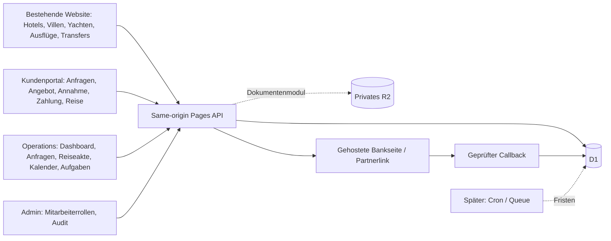

# Umsetzungsplan

Stand vor Implementierung: 18.09.2026. Der Auftrag priorisiert eine vollständige vertikale Strecke; die weiteren Vollplattformmodule sind Folge-Meilensteine und werden nicht als fertig dargestellt.

## System / Sitemap

## Rollen / Sicherheitsgrenzen

Owner/Admin: Benutzer und Audit; Manager/Sales: Übernahme und Angebote; Operations: Reise-/Termindaten ohne Margen; Finance: Zahlung/Folio ohne Systemeinstellungen; Read Only: lesende Operations-Sicht. Berechtigungen serverseitig, nicht aus Browserrolle. Kunden ausschließlich eigene/grantierte Anfragen. Cookie-Session, Origin-CSRF, Rate Limits, Validierung, Audit, URL-Allowlist, keine Secrets/Bankkarten im Browser. Private Dokumente benötigen separates Berechtigungsmodul.

## Datenmodell

Jetzt: User (Tokenhash, Rolle, Sperre), Session, Inquiry/Trip als kompatibles Request-Aggregat, QuoteVersion, QuoteItem-Snapshot, PaymentIntent, Payment/Folio, Supplier/Service, Booking, CalendarEvent, Task, AuditEvent, AccessLink/Grant, Importnachweis. IDs und Versionen, Zeitstempel, Akteur und Fremdschlüssel. Neue Kunden kommen zunächst über Kontakt-Snapshot; deduplizierter Customer-Stamm ist Folgearbeit.

Ziel: Role, Permission, Team; Customer → Traveler/Consent/Trip; Trip → Inquiry/Quote → QuoteVersion → QuoteItem; Service → Booking/Supplier; Supplier → SupplierContact/SupplierContract/PartnerSettlement; Trip → Task/CalendarEvent/Message/Document; PaymentIntent → Payment/Refund; Currency/ExchangeRate; Notification/AuditEvent. Beziehungen erhalten referenzielle Integrität, kritische Änderungen Transaktionen. Soft Delete für Stammdaten, keine Löschung verbuchter Ledgerzeilen.

## APIs / Ablauf

`/api/v1/session`, `/requests`, `/requests/:id`, `/access`, `/partners`, `/services` übernehmen. Ergänzen: `/requests/:id/claim`, `/quote-versions`, `/operations`, `/calendar`, `/tasks`, `/users`, `/audit`. Bankadapter bleibt `/api/pay/start` und `/api/pay/return/:provider`.

Anfrage → Mitarbeiterübernahme → individuelle Angebotsversion → privater Portallink → Kundenannahme → Zahlungsanforderung (Partner oder manuell) → Finance verbucht belegten Eingang → Mitarbeiter bestätigt → DB erzeugt Buchung/Termin → Portal zeigt Reise. Für Bank: ausschließlich DB-Betrag, eindeutiger Versuch, geprüfte Signatur/Betrag/Währung/Merchant, wiederholter Callback ohne Doppelbuchung. Bankadapter bleibt ohne bestätigte Konfiguration gesperrt.

## UX-Wireframes

| Ansicht | Desktop | Smartphone |
|---|---|---|
| Öffentliche Website | Breiter Hero, Navigation, mehrspaltige Reiseangebote, Footer | Vorhandene Touch-Navigation, vertikale Karten |
| Mitarbeiter-Dashboard | Sidebar · Braucht Aufmerksamkeit · Anfragen/Termine | Kompakte Navigation · nächste Aufgabe · Agenda |
| Admin-Dashboard | Mitarbeiterliste/Rolle/Sperre · Audit | Einspaltige Formulare und Ereignisse |
| Reiseakte | Kopf mit Nummer/Status/Zuständigkeit · Angebot/Zahlungen/Termine/Verlauf | Abschnitte und große Aktionen |
| Kalender | Datums-/Ressourcenfilter · Agenda; später Tag/Woche/Monat | Agenda, Status als Text |
| Kundenakte | Kontakt, Reisen, Einwilligung, Dublettenprüfung (Folgemodul) | Kontakt und Reisehistorie |
| Angebotseditor | Preis, Währung, Bedingungen, Versionen; später mehrere Positionen | Beschriftete Felder, Freigabeaktion |
| Zahlungsübersicht | Forderungen, Belege, Original-/Basiswährung | Folio je Reise, Restbetrag und Referenz |

## Kalender / Migration

Bestätigung erzeugt Termine idempotent. Ressourcenüberschneidungen blockieren kritische Planung, keine unbemerkte Verschiebung. UTC + Europe/Istanbul als initiale Anzeigezone. Agenda zuerst, iCal und andere Ansichten später. Aufgaben/Fristen mit Reiseverknüpfung, keine automatischen Nachrichten.

Migration: Legacy-Schlüssel erkennen, Original behalten/exportieren, Vorschau und expliziter Import. Wiederholter Import dedupliziert über stabile Identität. Historische Preise/Zahlungen nur zur internen Prüfung, nie automatisch zahlungswirksam. Anschließend Serverdaten; Entwürfe/Cache sind keine Zustellbestätigung.

## Meilensteine und Prüfung

0. Analyse, Recherche, ADR, Plan committen.
1. Vorhandenen Backendbranch gezielt wiederverwenden, Sicherheitsgrenzen härten; DB/API/Unit-Tests.
2. Rollen, Übernahme, QuoteVersion, Bestätigung/Buchung/Agenda/Aufgaben; Operations-Oberfläche. Kompletter E2E mit getrennten Browserkontexten.
3. Responsive Integration und Screenshots bei 360×800, 390×844, 430×932, Tablet, 1366×768, 1440×900, 1920×1080; Overflow/Fokus/Fehlerzustände.
4. Staging-Runbook, .env.example, Bindings, CI, PR mit Nachweisen. Keine Produktionsumstellung.
5. Danach: vollständiger Positionseditor/PDF, Customer-Merge, Dokumente/R2, Passwortreset/Einladungen/MFA, volle Kalenderansichten/iCal, Partnerabrechnung/Refunds/Reports, Datenschutzworkflows.

Tests: echte SQL-Migrationen/Transaktionen; Auth/IDOR/Rollen/Feldschutz; Callback/Replay/Betragsmanipulation; Versionenkonflikte; Migration/Dubletten; Kalenderüberschneidungen; getrennte Geräte bis bestätigte Reise. Kein Test ersetzt Bank-UAT oder rechtliche Abnahme.

## Deployment / Risiken / externe Entscheidungen

Separate Staging-/Produktions-D1, Migration vor Release, PR-Checks ohne Live-Zugang. D1-Backup vor Migration, additive Schemaänderungen; Rollback auf vorherige Anwendung nur bei kompatiblem Schema, sonst Restore in separate DB. Secrets nur in Cloudflare bzw. ignorierter .dev.vars. Kein Upload echter Kundendaten zu Tests.

Offen: Cloudflare-Konto/Projekt/DB-Bindings, Domain, Händlervertrag und API-Version, Testzugänge/Hash-Testvektoren/Fremdwährungen, echte Partnerzahlungslinks und Bankkonten, E-Mail-Provider, Datenschutzverantwortlicher und Aufbewahrungsfristen. Ohne diese Daten ist lokales End-to-End möglich, Online-/Bankabnahme jedoch nicht behauptbar.
