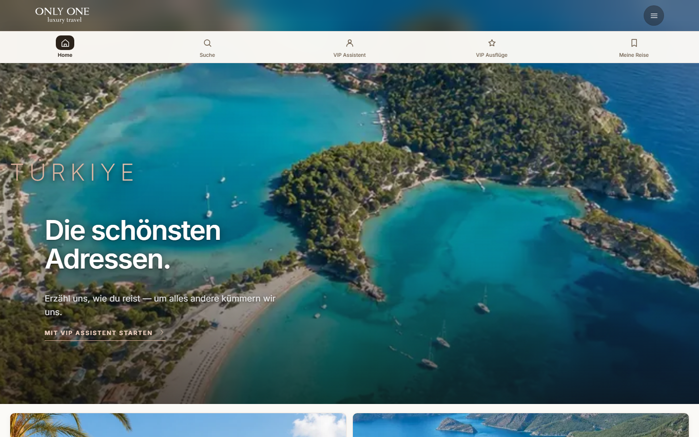
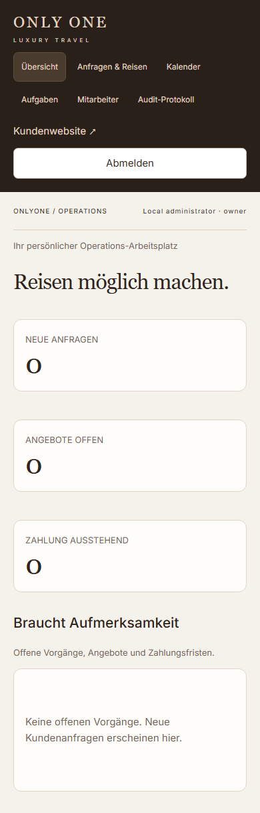
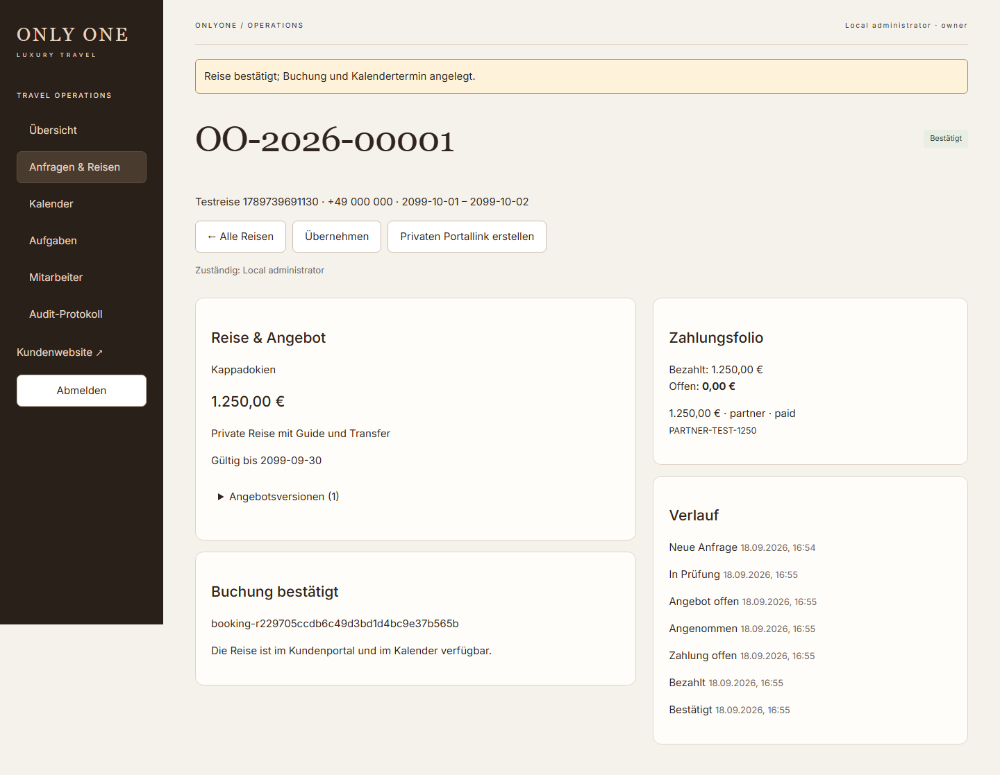
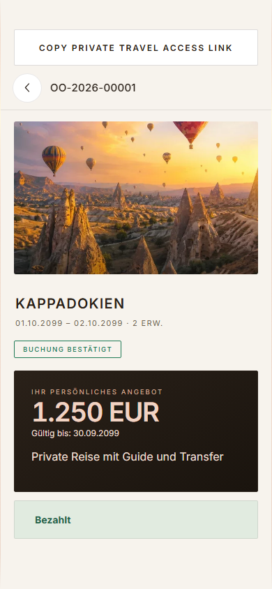
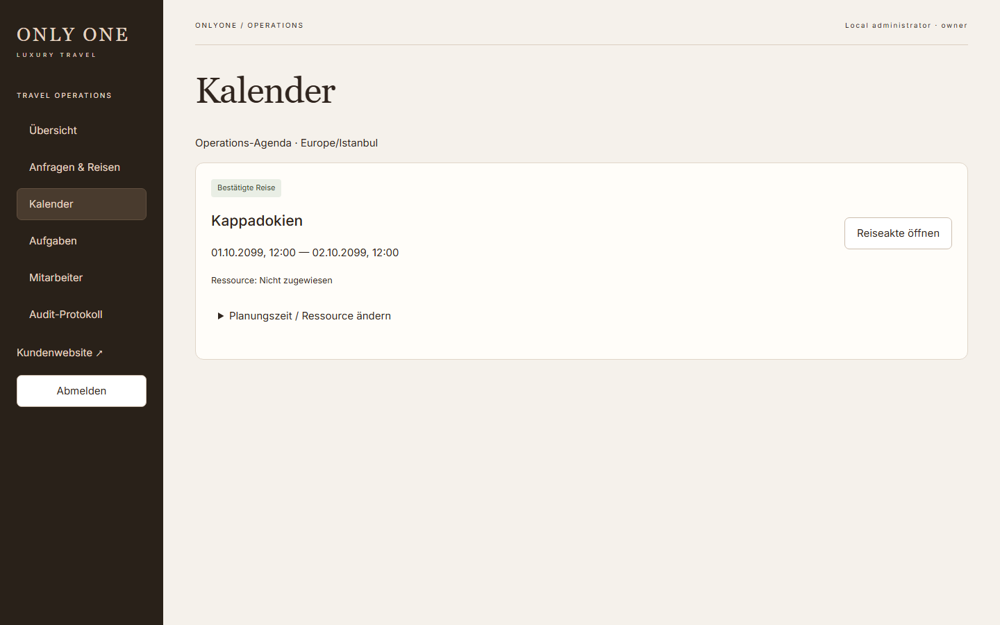

# Meilenstein 1 – gemeinsame vertikale Strecke

18.09.2026, Branch `codex/oo-travel-platform`, Ausgangspunkt main `7e39fc2`.

## Ergebnis

Die bestehende Kundenseite sendet echte Anfragen an Pages Functions/D1. Mitarbeiter sehen sie in einer anderen Browsersitzung, übernehmen sie, erstellen ein versioniertes Angebot und geben einen privaten Portallink weiter. Der Kunde akzeptiert; Finance fordert eine manuelle oder Partnerzahlung an, prüft den Eingang und verbucht ihn. Die Bestätigung erzeugt Buchung, Kalendertermin und Voucher-Aufgabe. Das Kundenportal zeigt die bestätigte Reise. Kein automatischer Versand und kein realer Bankeinzug wurden durchgeführt.

Persönliche Mitarbeiterzugänge mit Serverrollen, Sperren aller Mitarbeitersessions, Origin-CSRF-Prüfung, Rate Limits, Objektberechtigungen und interne Feldredaktion sind vorhanden. Angebote bleiben versioniert; veraltete Annahmen und Rücksetzung akzeptierter Angebote sind gesperrt. Zahlungscallbacks sind persistent und gegen manipulierte Beträge/Signaturen abgesichert; Ziraat bleibt bis zur Bankabnahme deaktiviert.

## Dateien / Entscheidungen

| Bereich | Dateien |
|---|---|
| Analyse und Planung | current-system-analysis.md, research-and-decisions.md, architecture/adr-001-backend-platform.md, implementation-plan.md, architecture/wireframes.md |
| Backend | functions/_lib/{security,permissions,model,payments,catalog,operations}.js, functions/api/v1/[[path]].js, functions/api/pay/* |
| Datenbank | migrations/0001–0005: Aggregate, Rollen, Audit, Angebotsversionen, Buchungen, Kalender, Aufgaben, zentrale Nummern |
| Kundenwebsite | public/js/app.js, backend.js, catalog.js, index.html, css/responsive.css, _headers, _routes.json |
| Operations | public/operations.html, public/js/operations/{api,trips,main}.js, public/css/operations.css |
| Betrieb/Tests | README.md, deployment-checklist.md, .env.example, .dev.vars.example, wrangler.jsonc, bootstrap-owner.js, tests/, playwright.config.cjs, platform-checks.yml |

Cloudflare-native Architektur, vorhandenes Vanilla-Frontend und gezielt geprüfte Komponenten aus `feature/shared-cloudflare-backend` statt Austausch der Website. Für diese Strecke kein zusätzliches Framework. Details und Alternativen im ADR.

## Nachweise

- 19 Unit-/API-/SQLite-Tests bestanden: Rollen, IDOR, CSRF, Rate Limits, Sessionwiderruf, Angebotsversionen, stale writes, Preisredaktion, Wechselkurse, Callback-Manipulation und Wiederholung, Import, Kalenderüberschneidungen und Bestätigungsbedingungen.
- 6 Browserprüfungen gegen echte lokale Pages Functions/D1 bestanden: vollständiger UI-Ablauf, getrennte Geräte, Partnerkatalog, Login/Logout, Migration/Konflikt-/Offlinebehandlung und responsive Ansichten.
- Layouts bei 360×800, 390×844, 430×932, 768×1024, 1366×768, 1440×900 und 1920×1080 geprüft. Operations-Dashboard und Reiseakte sowie öffentliche Startseite ohne horizontalen Dokument-Overflow. Screenshots visuell geprüft.
- JavaScript-Syntaxprüfung, Functions-Kompilierung und additive SQL-Migrationen erfolgreich.
- Browserdatenbank wird pro Testlauf neu angelegt; kein anderer lokaler Server wird wiederverwendet. Ein Versionsstempelabgleich verhindert irreführende Updatebanner im Test. Private Portalfragmente bleiben bei Build-Updates erhalten.

Screenshots enthalten ausschließlich synthetische Testdaten:

Alle weiteren Größen liegen im Verzeichnis `screenshots/`.

## Grenzen und nächste Schritte

Dies ist **keine vollständige, produktiv abgenommene Agenturplattform**. Nicht umgesetzt: vollständiger Positionseditor/PDF, privater Dokumentenspeicher, komplette Kundenkartei mit Merge, Reports/Partnerabrechnung, alle Kalenderansichten/iCal, OIDC/MFA/Passwortreset, automatisierte Erinnerungen und vollständige Operations-Übersetzungen. Siehe priorisierten Plan und Deployment-Checkliste. Keine Screenreader-Konformität oder gemessenen Lighthouse-Werte behauptet; manuelle Barrierefreiheits-/Realgerätetests bleiben nötig.

Die Website besitzt weiterhin historisches Vanilla-JS in app.js; neue Fachbereiche sind modular. Tagesgenaue Reisedaten erzeugen zunächst einen Planungszeitpunkt (09:00 UTC); Mitarbeiter müssen reale Abhol-/Leistungszeiten abstimmen. Eine D1-Buchung ist keine Lieferantenbestätigung. Persönliche Token sind eine begrenzte Auth-Stufe, kein fertiger Identitätsprovider-Lebenszyklus. Gästelinks sind zeitlich begrenzte Zugangsberechtigungen und dürfen nicht öffentlich geteilt werden.

Extern offen: Cloudflare-Anmeldung (lokal nicht vorhanden), Staging-Projekt und separate D1-IDs, Domain, Bankvertrag/API/Testdaten/Währungsfreigaben sowie echte Partner-Zahlungsdaten. GitHub-Repositoryzugriff ist vorhanden; Staging und Produktion wurden nicht umgestellt. Nächster Schritt ist die dokumentierte Staging-Abnahme, danach gezielter Ausbau der Folgemodule.
